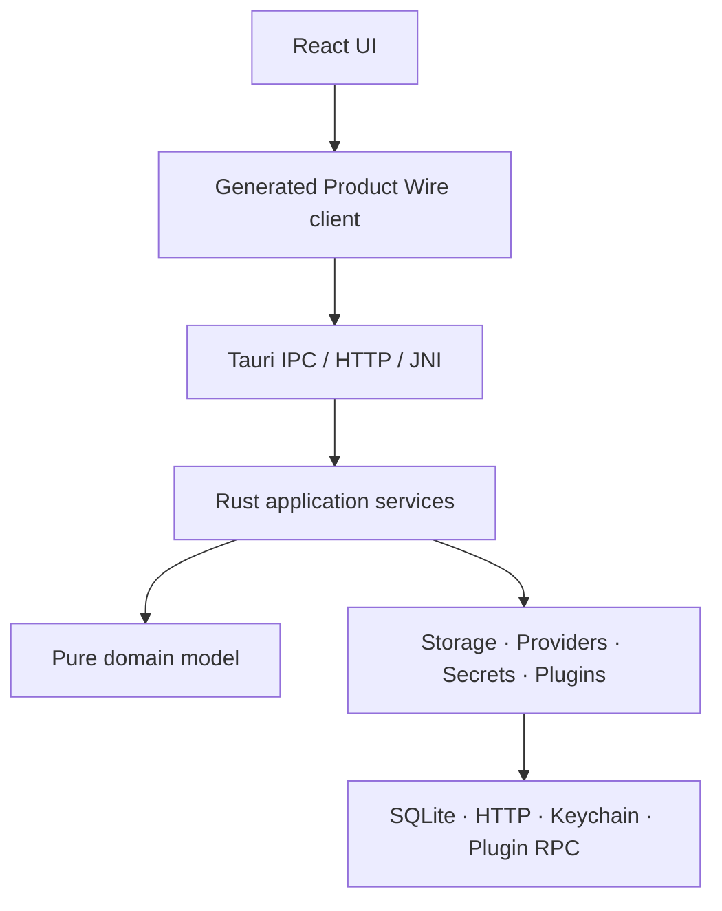
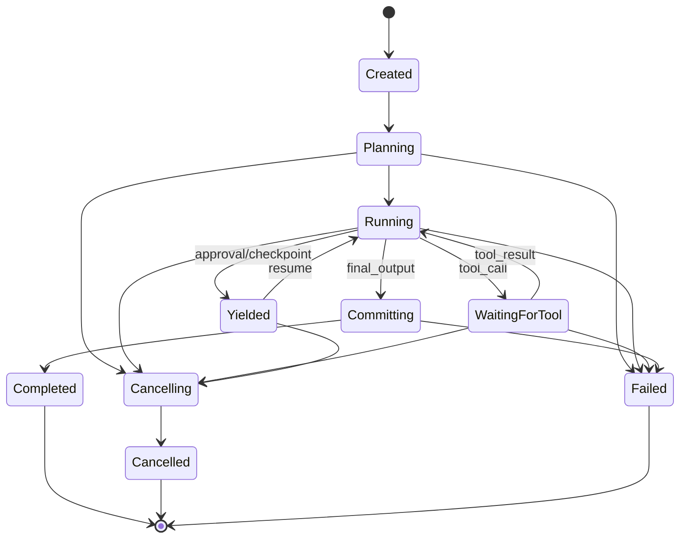

# Техническое задание: целевая архитектура NeoTavern 10/10

**Проект:** [Disya123/NeoTavern](https://github.com/Disya123/NeoTavern)  
**Базовый снимок:** `main`, commit `85b3d3d188b0f6f5130350f44581fa56ef38584b`  
**Дата:** 13 августа 2026 года  
**Редакция:** 2 — platform/compatibility hardening  
**Статус документа:** Proposal / основание для ADR и декомпозиции в roadmap  
**Связанный аудит:** `NeoTavern_viability_audit_2026-08-13.md`

---

## Ключевые изменения редакции 2

- Legacy Compatibility превращён в authority-non-expanding boundary: canonical SQL запрещён независимо от consent, добавлены три support tier, scoped VFS и разделение permanent adapter/migration shims.
- PWA переопределена как Remote/Installable Web Client; standalone Browser Runtime с WASM/OPFS явно вынесен в отдельный продуктовый трек.
- Миграция и restore получили versioned data roots, durable activation journal и Windows restart-to-complete protocol при sharing violations.
- Линейная streaming state machine заменена durable `GenerationRun`/`GenerationStep` с tool calls, `WaitingForTool`, `Yielded`, budgets и idempotent external effects.
- `SecretStore` дополнен Portable mode с `secrets.enc`, master passphrase, AEAD, Argon2id и cross-machine acceptance tests.

---

## 1. Назначение документа

Настоящее техническое задание определяет работы, необходимые для превращения NeoTavern из системы с двумя частично пересекающимися backend-контурами в единый local-first продукт с одним продуктовым ядром, одним владельцем данных и одинаковой семантикой на Desktop, Headless/Web Client и Android в пределах явно заявленного support tier каждого host.

Под «архитектурой 10/10» в этом документе понимается не максимальное количество слоёв и технологий, а система, в которой:

- существует один источник продуктовой истины;
- направление зависимостей контролируется компилятором и CI;
- данные пользователя сохраняются при сбоях, обновлениях и миграциях;
- UI и hosts не дублируют бизнес-логику;
- security boundaries реализованы fail-closed;
- заявленные возможности подтверждаются packaged end-to-end тестами;
- user consent не может отменить системные инварианты;
- временные migration-механизмы имеют условия и дату удаления.

Документ не является разрешением немедленно переписать весь репозиторий. Каждая смена утверждённого стека и публичного контракта должна быть принята отдельным ADR.

---

## 2. Исходное состояние и проблема

В текущем состоянии в NeoTavern одновременно существуют:

1. зрелый продуктовый контур `React → Fastify → Drizzle → app.db`, содержащий большую часть функций, prompt pipeline и production providers;
2. целевой контур `React → Product Wire → Rust Runtime Kernel → database.sqlite`, содержащий сильные storage/recovery primitives и native hosts, но ещё не достигший функционального паритета.

Дополнительные разрывы:

- default Desktop использует Kernel, тогда как значительная часть UI обращается к `/api/v2` или `legacyRaw()`;
- `app.db` и `database.sqlite` имеют разные схемы и migration stacks;
- Kernel по умолчанию не имеет production provider и полного prompt pipeline;
- Android APK не включает готовые web assets;
- существующие проверки не доказывают полный пользовательский сценарий в packaged Desktop и Android;
- экспорт профиля, plugin networking и package verification имеют критические security gaps;
- `AGENTS.md` утверждает Fastify/Drizzle/Node-sidecar как основной стек, а новая документация и часть кода — Rust Kernel.

Главная причина архитектурного риска — не качество отдельных компонентов, а наличие двух владельцев продуктовой логики и данных.

---

## 3. Цель проекта

Создать единое кроссплатформенное ядро NeoTavern, обеспечивающее полный пользовательский цикл:

> запуск → выбор/создание персонажа → создание чата → ввод сообщения → сборка prompt → один или несколько provider/tool steps → streaming → атомарное сохранение → перезапуск → продолжение чата → backup/restore.

Этот цикл должен иметь одинаковую продуктовую семантику на hosts/modes, помеченных `Released`, в пределах их support tier и не зависеть от прямого доступа UI к legacy Fastify API.

### 3.1. Измеримый итог

Работа считается завершённой, когда:

- Rust Runtime Kernel является единственным владельцем продуктовой логики и persistent state;
- существует одна каноническая SQLite-схема и один migration ledger;
- весь production UI использует только типизированный `NeoBackend`/Product Wire client;
- Desktop, Headless и Android используют одно application core, а Web Client является честным remote client к Headless и не заявляется как standalone-offline runtime;
- старый Fastify/Drizzle product core удалён или изолирован как явно устанавливаемый compatibility adapter без доступа к основной БД;
- P0/P1 security blockers, перечисленные в разделе 12, закрыты;
- acceptance suite проходит на чистой установке, обновлении и восстановлении после сбоя.

---

## 4. Обязательное архитектурное решение

До начала миграции необходимо принять ADR со следующим решением:

> Rust Runtime Kernel становится каноническим application core NeoTavern. Fastify/Drizzle-контур переводится в legacy/migration mode. Новая продуктовая логика реализуется только в Kernel. Исключения требуют отдельного ADR.

ADR должен:

- явно отменить или изменить пункты `AGENTS.md` об обязательном Fastify/Drizzle/Node-sidecar core;
- зафиксировать канонический database filename и data-root layout;
- определить судьбу Fastify, Node sidecar и TypeScript provider adapters;
- определить support policy для Desktop, Headless/Web Client и Android;
- явно решить, входит ли standalone browser/WASM runtime в product scope; по умолчанию он не входит в настоящее ТЗ;
- перечислить обратную совместимость и условия удаления legacy;
- зафиксировать запрет live dual-write между `app.db` и `database.sqlite`;
- содержать альтернативы: сохранить Node core, завершить Rust core, полный rewrite;
- объяснить, почему выбранный вариант лучше соответствует standalone Android, local-first и single-writer требованиям.

До принятия ADR Kernel нельзя объявлять production replacement старого backend, а legacy-контур нельзя удалять.

---

## 5. Целевая архитектура

NeoTavern должен быть модульным монолитом с портами и адаптерами.



### 5.1. Слои и ответственность

| Слой | Ответственность | Запрещено |
|---|---|---|
| Domain | Сущности, value objects, инварианты Character/Chat/Message/Prompt/Generation | SQL, HTTP, Tauri, JNI, JSON-RPC, UI types |
| Application | Use cases, транзакции, orchestration, authorization, idempotency | Конкретный SQLite/HTTP driver, presentation logic |
| Ports | Интерфейсы Storage, Provider, SecretStore, AssetStore, PluginHooks, Clock, ID generator | Реализация внешних систем |
| Adapters | SQLite, filesystem assets, OS secret store, provider HTTP, plugin broker | Самостоятельные продуктовые правила |
| Hosts | Tauri commands, headless HTTP, JNI/FFI, CLI composition root | Дублирование use cases и прямой SQL |
| Web UI | Представление, TanStack Query server state, Zustand UI-only state | `/api/v2`, SQL, provider orchestration, обход Product Wire |

### 5.2. Рекомендуемые физические границы

Финальная структура может быть адаптирована к существующему workspace, но должна выражать следующие границы:

```text
apps/
├── web/                    # React UI
├── desktop/                # Tauri host/composition
├── android/                # Android host/composition
└── plugin-runtime/         # optional isolated Node executor

crates/
├── domain/                 # pure business model
├── application/            # use cases
├── ports/                  # traits and boundary types
├── storage-sqlite/         # canonical persistence adapter
├── provider-openai-compat/ # production provider adapter
├── runtime-kernel/         # composition and dispatch
├── remote-http/            # headless adapter
└── mobile-ffi/             # JNI/FFI adapter

packages/
├── contracts/              # Product Wire source of truth
├── generated-client/       # generated TypeScript client
├── plugin-sdk/
├── theme-sdk/
├── legacy-compat/          # long-lived public ST Compatibility API
├── migration-shims/        # temporary bridges with removal milestones
├── ui/
└── i18n/
```

Создание новых crates не является самоцелью. Граница выделяется физически, если это необходимо для запрета неправильной зависимости или независимого тестирования.

### 5.3. Направление зависимостей

Разрешённое направление:

```text
contracts/types
      ↓
domain ← application → ports
                    ↑
                  adapters
                    ↑
                   hosts
```

Обязательные правила:

- `domain` не зависит от adapters или hosts;
- `application` зависит только от domain и port interfaces;
- adapters зависят внутрь и реализуют ports;
- hosts выполняют composition и transport translation;
- UI зависит от generated client, но не от host implementation;
- plugin runtime не импортирует storage internals и не получает SQLite connection;
- legacy packages не могут быть зависимостями новых domain/application modules.

CI должен проверять dependency graph и запрещённые импорты.

---

## 6. Архитектурные инварианты

Следующие инварианты обязательны и проверяются автоматически:

| ID | Инвариант | Автоматическая проверка |
|---|---|---|
| ARC-01 | Все продуктовые операции проходят через Product Wire | Registry/client parity test |
| ARC-02 | UI не вызывает `/api/v2` напрямую | ESLint rule + repository scan |
| ARC-03 | `legacyRaw()` отсутствует в production UI | ESLint/AST rule |
| ARC-04 | Только canonical storage adapter пишет product data | Dependency test + code ownership |
| ARC-05 | Hosts не содержат бизнес-правил | Dependency/API surface test |
| ARC-06 | Одна каноническая schema и migration ledger | Workspace/schema check |
| ARC-07 | Каждый публичный request/response/event runtime-валидируется | Contract corpus |
| ARC-08 | Плагины не имеют ambient capabilities | Security integration suite |
| ARC-09 | Каждый временный migration shim имеет owner и removal milestone | CI manifest check |
| ARC-10 | Документация не помечает Designed как Released | Generated capability matrix |
| ARC-11 | Legacy compatibility не расширяет authority native capability | Capability mapping test |
| ARC-12 | Web Client не заявляет offline product capability без browser runtime | Release manifest/docs check |

Допускаются временные исключения только через файл архитектурных исключений со следующими полями: owner, причина, затронутые файлы, дата создания, issue, крайний срок удаления. Просроченное исключение блокирует CI. Исключение или пользовательский consent не могут разрешить direct canonical SQL, чтение `SecretStore`, обход Product Wire либо второй product-data writer.

---

## 7. Product Wire и публичные контракты

### 7.1. Единый registry

`packages/contracts` остаётся единственным источником transport-контрактов. Из registry должны генерироваться:

- TypeScript client и типы;
- Rust DTO/operation metadata;
- JSON Schema fixtures;
- документация операций;
- compatibility manifest;
- capability matrix.

Ручное дублирование DTO между TypeScript, Rust, Kotlin и документацией запрещено.

### 7.2. Обязательная metadata операции

Для каждой операции должны быть определены:

- стабильное имя и версия;
- request/response/event schema;
- required scope/capability;
- idempotency policy;
- retry policy;
- timeout/cancellation behavior;
- максимальные размеры request/response;
- error codes;
- streaming semantics;
- compatibility classification: additive, deprecation или breaking.

### 7.3. Ошибки

Все boundary errors должны иметь форму:

```json
{
  "code": "CHARACTER_NOT_FOUND",
  "params": { "characterId": "..." },
  "traceId": "...",
  "retryable": false
}
```

Backend не передаёт готовый пользовательский текст. Локализация выполняется в UI. Неизвестная ошибка преобразуется в стабильный `INTERNAL_ERROR`, а технические детали остаются в redacted diagnostics.

### 7.4. Версионирование

Необходимо независимо версионировать:

1. Product Wire protocol;
2. storage schema;
3. Plugin SDK;
4. Theme SDK;
5. export/import format.

Версия приложения не заменяет версии этих контрактов. Для двух соседних released major/minor версий должна публиковаться compatibility table.

---

## 8. Домен и application services

### 8.1. Обязательные bounded contexts

Kernel должен владеть следующими контекстами:

- Library: characters, personas, lorebooks, assets;
- Conversations: chats, messages, variants, revisions, drafts;
- Prompting: macros, context selection, token budget, instruct rendering;
- Generation: provider turns, tool loops, streaming, yield/resume, cancel, retry, durable state;
- Configuration: profiles, non-secret settings, capabilities;
- Extensions: plugin manifests, grants, hooks, lifecycle state;
- Data lifecycle: import, export, backup, restore, migration, diagnostics.

Границы не обязаны становиться отдельными процессами или базами.

### 8.2. Транзакционные use cases

Каждый mutation use case должен явно определять:

- входные инварианты;
- transaction boundary;
- idempotency key, если операция повторяема;
- последовательность durable writes;
- события после commit;
- cancellation point;
- поведение при повторном запуске после crash;
- стабильные ошибки.

Событие об успешной операции нельзя публиковать до durable commit.

### 8.3. Generation run/step model

Примитивная модель `Created → Streaming → Completed` запрещена как основа домена: streaming является способом доставки событий, а не полным жизненным циклом генерации. Kernel должен моделировать durable `GenerationRun`, состоящий из одного или нескольких `GenerationStep`.



`GenerationStep` должен иметь как минимум следующие типы:

- `provider_turn`;
- `tool_call`;
- `tool_result`;
- `plugin_hook`;
- `user_approval`;
- `context_compaction`;
- `final_commit`.

Каждый step содержит `runId`, `stepId`, монотонный `sequence`, `attempt`, тип, status, timestamps, idempotency key, ссылки на bounded input/output и redacted error. Большие payload и media не копируются в event log, а адресуются content hash/reference.

Требования:

- переходы `GenerationRun` и `GenerationStep` валидируются в Kernel;
- `WaitingForTool` означает durable ожидание конкретного tool result, а не удержание открытой DB transaction;
- `Yielded` используется для user approval, внешнего ожидания, quota pause и безопасного resume;
- tool call до выполнения проходит schema validation, capability check, resource budget и policy/consent check;
- tool result добавляется в рабочий контекст и может инициировать следующий provider turn;
- задаются `maxSteps`, `maxToolDepth`, wall-clock deadline, token/cost budget и loop detection;
- каждый external effect имеет idempotency key; replay после crash не должен повторно отправлять письмо, изменять файл или создавать сообщение;
- `Completed` устанавливается только после атомарного сохранения финального assistant message и финального run state;
- partial text и незавершённые tool calls имеют явную retention/recovery policy;
- повторное transport-событие не дублирует delta, step или message;
- cancellation распространяется в активный provider request, tool, plugin hook и ожидание approval;
- после crash Kernel восстанавливает run из durable step/event journal и либо безопасно продолжает, либо переводит его в явный recoverable terminal state;
- приватный raw chain-of-thought не сохраняется и не показывается; допускаются только явно предоставленные provider reasoning summaries и технические status events.

---

## 9. Prompt pipeline и providers

### 9.1. Владение pipeline

Полная prompt orchestration должна находиться в Kernel/application layer. Базовый цикл:

```text
User input
→ Macros
→ Character/persona
→ Lorebook
→ Memory/RAG
→ Token counting
→ Context shifting
→ Plugin interceptors
→ Instruct rendering
→ Provider serialization
→ Provider turn / streaming events
→ [final output] Post-processing → Durable save
→ [tool call] Validate → Authorize → Execute → Tool result
→ Append result to working context → Next provider turn
```

Цикл provider/tool повторяется только в пределах run budgets. Для каждого этапа определяются input/output type, timeout, cancellation, idempotency, диагностический diff и поведение при ошибке.

### 9.2. Prompt plan

До сетевого запроса Kernel создаёт immutable `PromptPlan`, содержащий:

- выбранные сообщения и причины исключения остальных;
- character/persona/lorebook blocks;
- tokenizer profile и итоговый token budget;
- instruct format/version;
- список применённых plugin interceptors;
- provider/model parameters;
- redacted diagnostic representation.

Пользователь должен иметь возможность увидеть, какой контекст был исключён или сокращён.

### 9.3. Provider port

Единый provider interface должен поддерживать:

- validation конфигурации;
- model discovery;
- типизированный streaming event model: text delta, reasoning summary, tool-call delta/ready, usage, completion и error;
- `AbortSignal`-эквивалент/cancellation token;
- deadlines/timeouts;
- нормализацию ошибок;
- usage metadata;
- safe logging;
- объявление capabilities: tools, vision, thinking, JSON mode и др.

Provider adapter не исполняет tool самостоятельно и не изменяет product data. Он только возвращает нормализованный tool request; orchestration, authorization и durable step transitions выполняет Kernel. Для provider, не поддерживающего tools, capability negotiation должна завершаться до запроса с явным `CAPABILITY_UNAVAILABLE`, а не runtime fallback с изменением семантики.

Встроенные production providers размещаются за port interface. Минимальный обязательный provider для cutover — OpenAI-compatible. Fake/Recorded providers остаются test-only.

### 9.4. Секреты providers

Provider adapter получает secret только в момент выполнения через `SecretStore`. Secret:

- не входит в operation DTO;
- не хранится в основной БД;
- не попадает в prompt diagnostics, logs, exports и crash reports;
- очищается из памяти по возможности после завершения запроса;
- может быть отозван без изменения product data.

---

## 10. Данные, SQLite и миграция

### 10.1. Единственный владелец данных

После cutover только canonical Rust storage adapter может изменять основную SQLite DB. Hosts, UI, plugins, Fastify compatibility и provider adapters не получают прямого соединения.

Обязательные SQLite settings:

- `foreign_keys = ON`;
- WAL;
- `busy_timeout`;
- transactional migrations;
- STRICT tables, где возможно;
- FTS5 для поиска;
- prepared statements;
- integrity check после опасных операций.

### 10.2. Канонический формат

ADR должен установить один filename и layout. В настоящем ТЗ целевым считается `database.sqlite`; изменение допустимо только в ADR до реализации мигратора.

Original assets хранятся отдельно от БД. Cache полностью восстанавливаем и никогда не является единственной копией пользовательских данных.

Для migration/restore рекомендуется использовать versioned data roots и малый activation manifest, например:

```text
data-root/
├── roots/
│   ├── root-<old-id>/
│   └── root-<new-id>/
├── active-root.json
└── activation-journal.json
```

Конкретный layout утверждается ADR. Цель — не перезаписывать открытую canonical DB на месте и сохранять последнюю подтверждённую root до завершения активации.

### 10.3. Миграция `app.db → database.sqlite`

Мигратор обязан выполнять последовательность:

```text
Detect legacy data
→ Acquire exclusive maintenance lock
→ Preflight disk space and versions
→ Create verified backup
→ Convert into staging data-root
→ Validate schema, FK, counts and hashes
→ Produce human-readable report
→ Platform-aware commit/activation
→ Retain rollback pointer
```

Требования:

- live dual-write запрещён;
- исходная БД не изменяется;
- staging root создаётся на том же volume/filesystem, что и целевой data-root; cross-volume move не считается atomic commit;
- до активации закрываются все SQLite handles, выполняются WAL checkpoint/close и остановка sidecar, plugins, собственных indexers и background jobs;
- каждый этап фиксируется в durable `activation-journal` со статусами `prepared`, `validated`, `activation_pending`, `committed` или `rolled_back`;
- commit point определяется переключением малого activation manifest/pointer на полностью проверенный versioned root либо эквивалентной platform-specific replace primitive;
- запись файлов, SQLite snapshot и activation manifest должна быть flush/sync до объявления `committed` в пределах гарантий поддерживаемой ОС;
- повторный запуск мигратора идемпотентен;
- неизвестная будущая schema version обрабатывается fail-closed;
- unknown character/plugin metadata сохраняются;
- отсутствующие и повреждённые assets отражаются в отчёте;
- до активации пользователь может отменить операцию;
- при неудачной активации старый root остаётся единственным активным, а staging root сохраняется для retry или безопасно очищается после подтверждения пользователя;
- после активации доступен документированный rollback до первого нового mutation либо сохраняется отдельная immutable safety copy;
- тестовый corpus содержит базы всех released версий и намеренно повреждённые варианты.

### 10.3.1. Windows activation protocol

Реализация не должна полагаться на один вызов `std::fs::rename`. На Windows rename/replace может завершиться `sharing violation` или `access denied`, если файл открыт без delete sharing сторонним процессом, антивирусом, индексатором, backup/sync-клиентом либо самим NeoTavern.

Windows adapter обязан:

1. убедиться, что NeoTavern закрыл DB/WAL/SHM, file mappings, thumbnails и handles plugin runtime;
2. выполнять replace через проверенную platform-specific primitive и никогда не удалять старый root до подтверждения commit;
3. использовать bounded retry с exponential backoff и jitter только для классифицированных transient sharing/lock errors;
4. после исчерпания retry budget записать `activation_pending`, корректно завершить приложение и предложить **Restart to finish migration**;
5. на следующем bootstrap завершить activation до запуска plugins, UI data queries, SQLite и background services;
6. если блокировка остаётся, загрузить старый root в read-only/legacy-safe режиме либо остановиться с recoverable error — не открывать одновременно старый и новый writers;
7. показать пользователю сохранность старой копии, путь диагностического отчёта и действия `Retry`, `Restart`, `Open help`, `Export diagnostics`;
8. никогда не требовать отключения защиты как единственный recovery path. Инструкция временно приостановить конкретный scanner или добавить data-root в исключения допустима только после обнаруженной внешней блокировки, с предупреждением о риске и последующим повторным включением защиты.

Тесты Windows должны включать искусственно удерживаемые file handles без `FILE_SHARE_DELETE`, Defender/indexer-like contention, interruption до и после pointer switch, portable/removable drive и data-root в синхронизируемой папке. Поддерживаемый набор файловых систем и сетевых/removable volumes фиксируется отдельно; неподдерживаемая среда обнаруживается preflight до записи.

### 10.4. Backup и restore

- backup создаётся из консистентного snapshot;
- backup имеет manifest, checksums, schema version и app version;
- restore выполняется только в global maintenance mode;
- фоновые jobs, generations, plugins и новые mutations останавливаются;
- restore проходит в staging directory;
- активный data-root переключается через тот же platform-aware activation protocol и durable journal, что и migration;
- сбой/kill на любом шаге не уничтожает последнюю рабочую копию;
- backup/restore тестируется на реальном packaged build.

---

## 11. Hosts и transport adapters

### 11.1. Общие требования

Tauri, remote HTTP, CLI и JNI/FFI должны:

- вызывать один и тот же Kernel dispatch/application API;
- выполнять только transport framing, auth/session translation и lifecycle composition;
- не иметь собственных repository или prompt pipeline;
- возвращать одинаковые error codes;
- проходить один contract conformance suite.

### 11.2. Desktop

До достижения Kernel parity production build должен использовать честный default:

- либо tested legacy sidecar по умолчанию, а Kernel отмечен `experimental`;
- либо Kernel по умолчанию только после прохождения exit criteria этапа 3.

Запрещено поставлять shell, который запускается, но оставляет основные UI actions неработающими из-за отсутствующего `/api/v2`.

Packaged Desktop E2E должен запускать установленный/собранный Tauri artifact, а не только Vite и Fastify.

### 11.3. Headless и Web Client

Headless server — transport adapter над Kernel. Он не владеет отдельной БД или доменной логикой. Устанавливаемый web artifact в текущем scope является **Remote Web Client**, а не browser-hosted Kernel.

#### 11.3.1. Поддерживаемый remote mode

- Kernel, canonical DB, providers и secrets работают на пользовательском Headless/Desktop host;
- browser получает UI shell и обращается к Kernel через authenticated Product Wire HTTP/stream transport;
- service worker может кэшировать только versioned app shell и публичные static assets;
- API responses, chats, prompts, provider events и secrets не попадают в Cache Storage;
- без соединения Web Client показывает честный offline/connection screen и не разрешает mutations;
- local-first в этом режиме означает данные на контролируемом пользователем backend, а не автономную работу каждого браузера;
- документация и store metadata используют названия `Web Client` или `Installable Web Client`, а не обещание `standalone offline PWA`.

Требования Headless:

- loopback bind по умолчанию;
- явная настройка remote exposure;
- authentication и origin policy при non-loopback bind;
- SSE либо иной Product Wire streaming transport с backpressure;
- graceful shutdown и восстановимое завершение active generation runs;
- session revocation, CSRF/origin protection и TLS guidance для remote access.

#### 11.3.2. Standalone Browser Runtime — отдельный продуктовый трек

Сценарий «iPad в самолёте без Headless/Desktop» **не поддерживается настоящей архитектурой**. Его нельзя получить одним service worker или компиляцией transport layer в WASM.

Если standalone browser станет требованием, до реализации принимается отдельный ADR/RFC, включающий:

- browser-compatible application core: Rust/WASM либо отдельную доказанно эквивалентную реализацию;
- полностью async Storage port;
- SQLite WASM + OPFS/иной browser persistence adapter в Worker;
- Web Locks или эквивалентный single-writer protocol между tabs/workers;
- quota estimation, persistent-storage request, eviction detection и emergency export;
- crash recovery, migration, backup и schema compatibility в OPFS;
- browser secret encryption и unlock UX без OS vault assumptions;
- provider CORS/network model или пользовательский proxy;
- mobile Safari/iPadOS lifecycle, background suspension и storage behavior;
- отдельные conformance, migration, fault-injection и offline E2E suites.

До прохождения этих критериев standalone browser capability имеет статус `Not supported`, а не `Designed`, `Experimental` или `Offline-ready`.

### 11.4. Android

Android artifact должен:

- включать production `apps/web/dist` в assets;
- использовать тот же generated client и JNI transport;
- получать secrets через Android Keystore adapter;
- не требовать Node.js;
- корректно переживать activity recreation и process death;
- проходить instrumented user-flow E2E на emulator/device.

До выполнения требований Android маркируется Foundation/Experimental, а не Released.

---

## 12. Security architecture

Следующие задачи являются release blockers для Kernel cutover.

### SEC-01. Secret storage

- API keys, plugin secrets, OAuth tokens, PKCE material и session secrets исключаются из основной БД.
- Основная БД хранит opaque reference на secret.
- `SecretStore` является port с versioned records, namespace/profile isolation, enumerate/revoke и проверяемой backend metadata без раскрытия secret.
- Installed Desktop по умолчанию использует OS credential vault/keychain; Android — Keystore-backed storage.
- Headless использует явно настроенный environment/file secret provider либо encrypted store; выбранная policy документируется при deployment.
- Portable Desktop использует отдельный `PortableEncryptedSecretStore`, размещённый внутри portable data-root как versioned `secrets.enc`.
- Отсутствие безопасного secret backend приводит к явной ошибке или session-only secret, а не plaintext fallback.

#### SEC-01.1. Portable mode

Portable mode является явным install/profile mode, а не неявным fallback после ошибки OS vault. При первом запуске пользователь выбирает один из вариантов:

1. `Portable encrypted` — secrets переносятся вместе с папкой и защищены master passphrase;
2. `Machine-bound` — используется OS vault, а UI явно предупреждает, что secrets не переносятся;
3. `Session-only` — secrets не сохраняются после закрытия приложения.

Требования к `secrets.enc`:

- authenticated encryption: XChaCha20-Poly1305 либо AES-256-GCM;
- ключ выводится из master passphrase через Argon2id с versioned salt/parameters; конкретные параметры фиксируются security ADR и benchmark;
- random nonce не переиспользуется, format/version и KDF parameters аутентифицированы;
- master passphrase и derived key не записываются на диск, в logs, crash dumps или основную БД;
- app поддерживает auto-lock, ручную блокировку и best-effort zeroization;
- смена passphrase выполняет staged re-encryption и platform-aware activation без потери предыдущего файла;
- при переносе папки на другой компьютер достаточно файла и master passphrase; machine identity не является частью portable key derivation;
- machine-bound vault reference на другом устройстве возвращает стабильный `SECRET_UNAVAILABLE_ON_THIS_DEVICE` и предлагает повторный ввод, а не выглядит как повреждение профиля;
- потерянный master passphrase нельзя «восстановить» скрытым ключом приложения: пользователь повторно вводит provider keys;
- profile export и diagnostic export не включают `secrets.enc`; полный перенос portable-папки и отдельный encrypted secret backup описываются разными UX-действиями;
- переключение OS vault ↔ portable store выполняется транзакционным copy/verify/activate flow с возможностью отмены до удаления source records.

Обязательные тесты: перенос Windows → другой Windows user/machine, неверный пароль, повреждённый header/ciphertext, interrupted re-encryption, downgrade format, auto-lock, отсутствие secrets в DB/export/logs и session-only cleanup.

### SEC-02. Logical export

- Profile export строится по allowlist сущностей и полей.
- Snapshot всей DB не может использоваться как profile export.
- Secrets, auth/session data, OAuth material и данные других profiles исключаются.
- Тест помещает уникальные sentinel secrets во все secret stores и подтверждает их отсутствие в архиве и manifest.

### SEC-03. Plugin network broker

- URL и адреса нормализуются, включая bracketed IPv6 и IPv4-mapped IPv6.
- Проверяются все DNS answers.
- Соединение выполняется с проверенным IP; hostname сохраняется только для Host/SNI.
- После connect проверяется `remoteAddress`.
- Каждый redirect заново проходит policy.
- Одинаковая policy применяется к HTTP, HTTPS, WebSocket и TCP-capable interfaces.
- Loopback, private, link-local, multicast, unspecified и cloud metadata ranges запрещены без отдельного grant.

### SEC-04. Bounded streaming

- compressed и decompressed byte counts ограничиваются до накопления тела;
- response уничтожается сразу при превышении limit;
- вводится общий per-plugin и global in-flight byte budget;
- поддерживаются backpressure, timeout, cancellation и slowloris protection;
- provider media outputs и imports имеют size/disk-space preflight.

### SEC-05. Plugin package trust

- До consent/install проверяются publisher signature и digest каждого файла.
- Trust state явно различает built-in, verified publisher, locally trusted и unsigned/untrusted.
- Изменение permissions после update требует повторного consent.
- Install является staging + verify + platform-aware activate с recovery journal.
- ZIP path traversal, symlinks, zip bombs и duplicate normalized paths отклоняются.

### SEC-06. Extension isolation

- Backend plugins работают только в отдельном процессе/Worker sandbox.
- Frontend plugins — sandboxed iframe + versioned RPC; legacy unmanaged island включается отдельным рисковым grant.
- Каждая регистрация возвращает cleanup handle.
- Disable удаляет handlers, timers, DOM, routes, jobs, subscriptions и background requests.
- Plugin failure не останавливает Kernel и не повреждает transaction.

### SEC-07. Diagnostics и privacy

- telemetry отсутствует по умолчанию;
- logs структурированы и имеют trace ID;
- redaction применяется централизованно до записи;
- diagnostic export использует allowlist;
- prompt diagnostics не содержат provider keys и plugin secrets;
- security tests проверяют отсутствие известных secret patterns.

---

## 13. UI и frontend data access

### 13.1. Единый facade

UI может работать только через `NeoBackend`/generated Product Wire client.

Запрещаются:

- прямой `fetch('/api/v2/...')` в feature code;
- `legacyRaw()` в production components/hooks;
- transport-specific branching в React components;
- параллельное хранение одной server entity в TanStack Query и Zustand.

Если capability ещё не мигрирована, UI получает типизированный `CAPABILITY_UNAVAILABLE` и показывает честный status. Нельзя молча обращаться к другому backend.

### 13.2. Streaming

- streaming events приходят в едином формате;
- UI обновляется пакетно, не более 30 раз в секунду;
- reconnect/replay опирается на sequence/event ID;
- duplicate event не дублирует текст, tool call, tool result или run step;
- UI различает text streaming, tool execution, waiting for approval, suspended, cancelling и committing;
- опасный tool показывает понятное действие, запрашиваемую capability и scope до consent;
- cancellation доступен пользователю и подтверждается Kernel;
- финальный UI state сверяется с durable message после completion.

### 13.3. Capability matrix

Из Product Wire registry и release manifest генерируется матрица:

| Capability | Designed | Implemented | Integrated | Packaged | Released |
|---|---:|---:|---:|---:|---:|

README и docs используют эту матрицу и не поддерживают отдельные ручные заявления о готовности.

---

## 14. Plugin и legacy compatibility

### 14.1. Место plugin runtime

Node plugin runtime допускается как optional Desktop/Headless adapter. Kernel не должен зависеть от наличия Node для базового чата, provider generation, Android и data lifecycle.

Plugin runtime взаимодействует с Kernel только через versioned capability protocol и не получает прямой доступ к:

- SQLite;
- data-root filesystem;
- OS secret store;
- внутренним Rust/React types;
- transport implementation.

### 14.2. Legacy compatibility

Совместимость SillyTavern является совместимостью **на границе системы**, а не обязанностью Kernel воспроизводить старую backend-архитектуру.

Главный инвариант:

> **Legacy compatibility MAY translate or restrict an operation, but MUST NOT grant more authority than the corresponding native capability.**

Для каждого legacy API определяется:

- supported contract;
- точное отображение в одну или несколько native capabilities/Product Wire operations;
- host availability;
- sandbox/isolation level;
- compatibility test;
- security/resource limits;
- support и versioning policy.

#### 14.2.1. Уровни совместимости

| Уровень | Реализация | Статус |
|---|---|---|
| Native compatible | Legacy API переводится в обычные Product Wire/capability calls | Fully supported |
| Sandbox compatible | Плагин исполняется изолированно и видит только broker, scoped VFS и выданные capabilities | Supported with limitations |
| Architecturally incompatible | Нужны raw canonical SQL, Kernel internals, unrestricted secrets, hidden superuser или нарушение single-writer | Unsupported |

NeoTavern не обещает 100% совместимость со всеми SillyTavern extensions. Обещается предсказуемая совместимость документированного класса расширений без изменения trust boundaries NeoTavern.

#### 14.2.2. Безусловные запреты

Прямой доступ legacy/plugin-кода к следующим ресурсам запрещён безусловно:

- canonical `database.sqlite`, WAL/SHM и storage connection;
- `SecretStore` и его backing files/vault APIs;
- Kernel internals, repositories и in-process memory;
- data других plugins;
- скрытая capability вида `legacy.superuser`;
- обход Product Wire для mutation product data.

User consent, debug mode и high-risk grant **не могут** отменить эти запреты.

Если plugin нужны characters/chats/messages, путь имеет вид:

```text
Legacy API
→ Compatibility adapter
→ Native capability / Product Wire
→ Application service
→ Canonical storage adapter
```

Если legacy operation невозможно безопасно выразить через native capabilities, необходимо либо добавить общеполезную, минимальную capability в публичный Plugin SDK через ADR/security review, либо маркировать operation unsupported. Создавать специальный неограниченный legacy bypass запрещено.

#### 14.2.3. Plugin storage и Virtual Filesystem

Плагин может получить private storage через `plugin.storage`. Реализация может использовать отдельный `plugins/<plugin-id>/plugin.sqlite`, KV или файлы, но физический путь остаётся деталью host adapter и не открывает data-root.

Legacy filesystem API переводится в scoped VFS:

```text
/data/extensions/<plugin-id>/cache.json
→ PluginFs capability
→ <data-root>/plugin-data/<plugin-id>/cache.json
```

VFS обязан обеспечивать path normalization, traversal/symlink protection, quota, atomic writes, cleanup и namespace isolation. Пути к canonical DB, secrets, другим plugins и произвольному user home отсутствуют в namespace.

High-risk consent допускается только для ограниченных, явно видимых действий:

- network access к произвольным public hosts;
- filesystem access к выбранному пользователем файлу/каталогу через picker-scoped grant;
- process execution на Desktop с отдельной командной allowlist/policy;
- legacy frontend unmanaged island.

Даже эти grants не дают canonical SQL, unrestricted home access или чтение secrets.

#### 14.2.4. Compatibility adapter не является вторым core

Compatibility layer не может содержать:

- собственные product repositories;
- отдельную реализацию prompt pipeline;
- самостоятельные rules для characters/chats/messages;
- собственный writer canonical data;
- transport-specific product behavior.

Его допустимая работа: parse legacy request, validate, translate, invoke native capability, translate response/error/event и применить дополнительные ограничения.

Monkey-patching внутренних React/Rust/Node объектов, зависимость от incidental CSS classes и произвольное изменение процесса считаются architecturally incompatible, если не покрыты отдельным стабильным публичным contract.

### 14.3. Permanent compatibility и migration shims

Необходимо разделять:

- `packages/legacy-compat/` — долгоживущий публичный `ST Compatibility API v1` со своим semver, support matrix и conformance suite;
- `packages/migration-shims/` либо эквивалентный модуль — временные `legacyRaw`, old DTO translation, dual routes, old schema readers и conversion bridges.

ARC-09 применяется к migration shims, а не автоматически ко всему публичному compatibility API. Стабильный adapter может поддерживаться годами, если не нарушает архитектурные инварианты. Каждый shim обязан иметь owner, issue, removal milestone и CI-enforced expiry.

Для каждого release публикуется список `fully supported`, `supported with limitations` и `unsupported` legacy contracts/plugins. Несовместимость расширения, требующего raw SQL или неограниченного процесса, считается осознанным архитектурным ограничением, а не дефектом Kernel.

---

## 15. Observability и эксплуатация

Система должна иметь local-first observability без обязательной внешней telemetry.

Обязательные элементы:

- trace ID от UI operation до Kernel, adapter и provider;
- structured logs с уровнями и event codes;
- локальный bounded ring buffer;
- generation timeline;
- migration/restore journal;
- plugin resource counters;
- cache hit/miss и memory limits;
- redacted diagnostic bundle;
- пользовательская возможность отключить расширенные diagnostics.

Логи не являются источником бизнес-состояния. Их потеря не влияет на данные пользователя.

---

## 16. Performance и resource budgets

Сохраняются целевые бюджеты проекта:

| Метрика | Бюджет |
|---|---:|
| Startup до ready UI на reference PC | ≤ 4 с |
| Idle backend/kernel memory | ≤ 180 MB |
| Первая страница библиотеки из 100 000 characters | ≤ 300 мс |
| Открытие последних сообщений чата из 10 000 сообщений | ≤ 700 мс |
| UI streaming updates | ≤ 30/с |
| Initial frontend bundle | ≤ 2 MB gzip без lazy chunks |

Дополнительные обязательные бюджеты должны быть определены benchmark ADR:

- memory при длинной streaming generation;
- максимальный plugin response body;
- global in-flight network bytes;
- import/export size и required free-space coefficient;
- backup/restore времени для reference library;
- Kernel dispatch overhead p50/p95;
- JNI batch/event overhead.

CI должен блокировать статистически значимую регрессию выше согласованного tolerance. Benchmark environment и fixtures фиксируются версионно.

---

## 17. Тестовая стратегия

### 17.1. Test pyramid

1. Domain unit tests — инварианты и state machines без I/O.
2. Application tests — use cases с in-memory/fault-injection ports.
3. Adapter integration tests — SQLite, provider HTTP, secret stores, plugin broker.
4. Contract conformance — один corpus для Rust/TS/Kotlin и всех transports.
5. Host E2E — Tauri, headless HTTP, Android.
6. Packaged upgrade/recovery tests — реальные artifacts и data fixtures.
7. Security/fuzz/property tests — границы доверия и corrupted input.

### 17.2. Golden vertical slice

Обязательный сценарий:

1. запустить приложение на пустом data-root;
2. создать character с image asset;
3. создать chat;
4. отправить user message;
5. применить persona, lorebook и instruct preset;
6. собрать и проверить PromptPlan;
7. получить streaming text и нормализованный tool call через controlled production-compatible test endpoint;
8. проверить capability, выполнить разрешённый tool и сохранить durable tool result;
9. продолжить второй provider turn после `WaitingForTool` и получить final output;
10. отдельно проверить user approval/yield/resume и отмену активного provider/tool step;
11. сохранить assistant message ровно один раз;
12. принудительно завершить процесс в заданных fault points, включая tool wait и final commit;
13. перезапустить и проверить deterministic recovery без повторного external effect;
14. создать backup, изменить данные, выполнить restore;
15. проверить отсутствие secrets в export/diagnostics;
16. в portable fixture перенести data-root в другой machine/user context и разблокировать secrets master passphrase.

Сценарий запускается через один набор assertions на Tauri и headless. На Android допускается сокращённый provider test transport, но весь UI → JNI → Kernel → storage путь должен быть реальным. Для Web Client проверяется remote flow и честное offline-состояние без скрытых local mutations; standalone browser flow не ожидается.

### 17.3. Host parity suite

Одинаковые request fixtures должны выполняться через:

- direct Kernel test transport;
- Tauri IPC;
- remote HTTP/SSE;
- JNI/FFI.

Сравниваются response schema, error code, run/step transitions, tool-call event order, idempotency и durable effect. Transport-specific metadata исключается явно.

### 17.4. Migration corpus

Corpus должен включать:

- чистые БД всех released schema versions;
- большие библиотеки;
- unknown extension fields;
- отсутствующие assets;
- orphaned records;
- interrupted legacy migration;
- corrupted page/WAL;
- future schema version;
- duplicate import fixtures;
- unicode/RTL/очень длинные значения.

Platform corpus дополнительно включает Windows sharing violations, held handles, removable drive, sync folder и interrupted `activation_pending`.

### 17.5. Fault injection

Необходимо уметь принудительно завершить процесс или вернуть ошибку:

- до/после DB commit;
- до/после publish event;
- во время asset rename;
- в середине migration;
- при Windows activation/pointer switch;
- в середине backup/restore;
- при provider stream, tool call и `WaitingForTool`;
- при plugin hook/external effect до и после idempotency commit;
- при portable secret re-encryption;
- при shutdown.

Критерий: подтверждённые пользователю данные не теряются, а незавершённые операции переходят в документированное recoverable state.

---

## 18. CI/CD quality gates

### 18.1. Обязательные проверки каждого PR

- formatting;
- lint;
- TypeScript typecheck;
- Rust fmt/clippy/test;
- unit/integration tests затронутых слоёв;
- Product Wire codegen clean diff;
- schema hash/semantic compatibility;
- dependency direction;
- запрет `/api/v2` и `legacyRaw()` в production UI;
- secret scanning;
- dependency/license audit;
- docs links/build;
- migration tests при изменении schema;
- generation run/step model и tool capability tests при изменении provider protocol;
- portable secret format/migration tests при изменении `SecretStore`;
- plugin cleanup/security tests при изменении extension boundary.

### 18.2. Обязательные проверки merge/release branch

- полный Playwright suite;
- packaged Tauri golden E2E;
- Android build с web assets и instrumented smoke;
- host parity suite;
- migration corpus;
- Windows lock-contention/restart-to-complete activation suite;
- backup/restore drill;
- portable cross-machine secret unlock suite;
- compatibility authority-mapping suite;
- Web Client offline-truthfulness test;
- fuzz/property tests с фиксированным минимальным budget;
- performance budgets;
- SBOM и artifact provenance;
- platform signing/notarization checks для публичного release.

### 18.3. Запрет ложнозелёного CI

Workflow не может считаться успешным, если:

- test suite пропущен из-за отсутствующего artifact;
- Android собран без `web/index.html`;
- packaged Desktop E2E тестирует Fastify вместо default backend;
- codegen создал незакоммиченный diff;
- docs build не запускался из-за invalid workflow;
- security audit завершился ошибкой без явного triage waiver.

Waiver должен иметь owner, issue, severity, expiry и обоснование.

---

## 19. Документация и архитектурное управление

### 19.1. Один источник документации

Необходимо устранить конкуренцию между `docs/` и `apps/docs/docs/`:

- выбрать одно authoring tree;
- Docusaurus импортирует или собирается из него;
- `docs:check` и `docs:build` проверяют один и тот же набор материалов;
- generated API/capability pages не редактируются вручную.

### 19.2. Обязательные ADR

До Stable должны существовать ADR:

1. Canonical core и судьба Fastify/Node sidecar.
2. Module boundaries и dependency direction.
3. Canonical storage schema и data-root.
4. Product Wire versioning.
5. Secret storage по hosts, включая Portable mode и cryptographic format.
6. Provider execution и generation run/step/tool model.
7. Plugin isolation и capability model.
8. Backup/restore и platform-specific migration activation, включая Windows recovery.
9. Host support tiers.
10. Performance reference environment.
11. Web Client remote mode и решение об отсутствии/наличии standalone Browser Runtime.
12. Legacy Compatibility API authority model и support policy.

### 19.3. Статусы возможностей

Используются только следующие статусы:

- `Designed` — решение описано;
- `Implemented` — код существует и имеет component tests;
- `Integrated` — используется реальным application flow;
- `Packaged` — присутствует в поставляемом artifact;
- `Released` — доступно пользователю и покрыто release acceptance;
- `Deprecated` — существует migration/removal policy.

README не может называть capability готовой на основании статуса `Implemented`.

---

## 20. План реализации

Оценки ниже являются порядком, а не обещанием календарного срока. Следующий этап начинается только после exit criteria предыдущего.

### Этап 0. Governance и безопасный baseline

**Цель:** прекратить расхождение двух архитектур.

Работы:

1. принять ADR о canonical core;
2. обновить `AGENTS.md`, README и architecture docs;
3. составить generated/checked feature-status matrix;
4. вернуть tested legacy sidecar как временный default либо явно маркировать Kernel build experimental;
5. запретить новые product features в legacy, кроме security/fixes/migration bridges;
6. исправить docs workflow;
7. завести список архитектурных исключений;
8. переименовать текущую PWA-поставку в Remote/Installable Web Client и явно отметить отсутствие standalone-offline режима;
9. принять compatibility authority rule и безусловный запрет canonical SQL.

**Exit criteria:** у каждого нового изменения однозначно определено место реализации; default artifact не притворяется функционально полным Kernel-продуктом.

### Этап 1. Security blockers

Работы:

1. logical profile export;
2. secret store abstraction, PortableEncryptedSecretStore и миграция secrets;
3. SSRF-safe network broker;
4. streaming byte budgets/backpressure;
5. mandatory plugin signature/digest verification;
6. maintenance lock для restore;
7. compatibility authority/VFS isolation tests;
8. regression/security tests.

**Exit criteria:** нет открытых P0 security findings; P1 либо закрыты, либо имеют ограниченный ADR waiver до cutover.

### Этап 2. Golden Kernel vertical slice

Работы:

1. Character CRUD + assets;
2. Chat CRUD;
3. Message create/edit/delete/list;
4. provider settings без secrets в DB;
5. OpenAI-compatible production provider;
6. prompt pipeline: history, character, persona, lorebook, instruct, token budget;
7. durable generation run/step model, tool-call loop, yield/resume и budgets;
8. streaming/cancel/retry/idempotent external effects/durable save;
9. Tauri packaged E2E;
10. direct `/api/v2` removal для этого flow.

**Exit criteria:** golden vertical slice проходит на packaged Desktop без Fastify product core.

### Этап 3. Data cutover

Работы:

1. закончить schema mapping;
2. встроить staged converter в application flow;
3. добавить progress/report/cancel;
4. проверить migration corpus;
5. реализовать versioned roots, activation journal, rollback/safety retention;
6. реализовать Windows bounded retry, `activation_pending` и restart-to-complete;
7. пройти upgrade на Windows с lock contention, macOS и Linux;
8. переключить canonical data-root.

**Exit criteria:** пользователь старой версии после обновления видит те же characters/chats/messages/assets; отказ на любом шаге не уничтожает legacy data.

### Этап 4. Полный UI/API cutover

Контексты мигрируются вертикально в порядке:

1. personas и полный lorebook CRUD;
2. message variants/revisions/drafts;
3. memories и presets;
4. remaining providers;
5. imports/exports/assets/thumbnails;
6. plugins/themes;
7. diagnostics и оставшиеся settings.

Для каждого среза обязательны contract → application → adapter → UI → E2E → удаление legacy route.

**Exit criteria:** repository scan не обнаруживает production-вызовов `/api/v2` или `legacyRaw()`; legacy Fastify больше не владеет product data.

### Этап 5. Headless/Web Client и Android parity

Работы:

1. сделать remote HTTP тонким Kernel adapter;
2. добавить auth/origin policy и streaming conformance;
3. зафиксировать Web Client как remote-only и проверить offline connection UX/cache policy;
4. встроить web assets в Android build;
5. завершить Keystore/JNI lifecycle;
6. добавить Android user-flow E2E;
7. проверить process death/restart;
8. удалить конфликтующие Android build paths.

**Exit criteria:** support matrix честно подтверждена artifacts и E2E.

### Этап 6. Legacy removal и Stable hardening

Работы:

1. удалить Drizzle product schema и legacy writer;
2. удалить временные migration branches и `legacyRaw()`;
3. сохранить документированный versioned ST Compatibility API, если он нужен, и удалить только migration shims;
4. провести recovery drills и performance tuning;
5. включить platform signing, SBOM и provenance;
6. пройти минимум два реальных upgrade cycles до Stable;
7. опубликовать migration/deprecation guide.

**Exit criteria:** один core, одна schema, один UI facade, отсутствие просроченных architecture waivers.

---

## 21. Правила декомпозиции на Pull Requests

Каждый PR должен быть вертикальным или инфраструктурно атомарным и содержать:

- связанную issue и архитектурный requirement ID;
- ограниченный scope;
- код и тесты;
- обновление документации/capability status;
- migration/compatibility note;
- rollback plan для data/security изменений;
- удаление заменённого legacy path, если parity достигнут.

Запрещаются PR вида «перенести все providers», «переписать всю БД» или «полностью заменить backend». Предпочтительный размер — один проверяемый use case или одна trust boundary.

### 21.1. Definition of Ready

Issue готова к реализации, если определены:

- owner;
- current и target flow;
- затронутые contracts;
- data migration impact;
- security boundaries;
- acceptance tests;
- telemetry/privacy impact;
- compatibility и deletion condition.

### 21.2. Definition of Done

Задача завершена только если:

- implementation используется production flow, а не только существует изолированно;
- tests проходят на нужном уровне;
- codegen и dependency checks чисты;
- docs и capability matrix обновлены;
- error/cancel/retry paths проверены;
- secrets не попадают в logs/export;
- compatibility mapping не расширяет native authority;
- platform-specific activation/recovery проверены, если задача меняет data-root или package state;
- временный bridge имеет removal issue;
- обязательные platform checks пройдены либо явно указано, почему они неприменимы.

---

## 22. Критерии приёмки программы работ

### 22.1. Архитектура

- [ ] Принят ADR о canonical Rust core.
- [ ] `AGENTS.md`, README и код не противоречат ADR.
- [ ] Dependency rules блокируют неправильные импорты.
- [ ] Hosts не содержат product repositories/prompt logic.
- [ ] Legacy code не является зависимостью нового domain/application core.
- [ ] Legacy adapter только переводит/ограничивает native capabilities и не имеет superuser path.

### 22.2. API и UI

- [ ] Все released capabilities представлены в Product Wire registry.
- [ ] Generated TS/Rust/Kotlin contracts совпадают.
- [ ] В production UI нет прямого `/api/v2` и `legacyRaw()`.
- [ ] Все transports проходят conformance suite.
- [ ] Streaming, tool calls, yield/resume, cancellation и replay имеют одинаковую семантику.
- [ ] Web Client явно является remote-only; offline mode не создаёт локальные product mutations.

### 22.3. Данные

- [ ] Одна каноническая SQLite DB и migration ledger.
- [ ] Нет live dual-write.
- [ ] Миграция legacy data проходит полный corpus.
- [ ] Backup/restore являются staged, verified и kill-safe.
- [ ] Windows sharing violation приводит к bounded retry/restart-to-complete, а не к повреждению или зависанию.
- [ ] Activation journal однозначно восстанавливается из каждого промежуточного состояния.
- [ ] Unknown metadata и original assets сохраняются.

### 22.4. Генерация

- [ ] Kernel собирает полный PromptPlan.
- [ ] Работает минимум один production provider.
- [ ] Cancellation доходит до network request и hooks.
- [ ] Tool call проходит validation/capability/budget и durable `WaitingForTool → Running` transition.
- [ ] Crash/replay не повторяет уже подтверждённый external effect.
- [ ] Completed response сохраняется ровно один раз.
- [ ] Crash/restart не создаёт silent data loss.

### 22.5. Security

- [ ] Secrets находятся вне основной БД.
- [ ] Portable `secrets.enc` переносится на другую машину и открывается master passphrase.
- [ ] Нет plaintext/machine-bound fallback, замаскированного под portable mode.
- [ ] Export/diagnostics не содержат sentinel secrets.
- [ ] SSRF suite закрывает DNS rebinding, redirects, IPv6 и mapped addresses.
- [ ] Network/media/import limits применяются потоково.
- [ ] Plugin signatures/digests проверяются до установки.
- [ ] Disable plugin полностью очищает ресурсы.
- [ ] Canonical SQL/SecretStore недоступны legacy/plugin code даже после high-risk consent.

### 22.6. Delivery

- [ ] Packaged Tauri E2E проходит golden flow.
- [ ] Android APK содержит UI assets и проходит instrumented flow.
- [ ] Headless server является тонким adapter над Kernel.
- [ ] Web Client без backend показывает connection/offline state и не заявляется standalone PWA.
- [ ] Performance budgets являются blocking gates.
- [ ] Docs workflow валиден и проверяет единый source tree.
- [ ] Release artifacts подписаны и имеют SBOM/provenance.

---

## 23. Условия релизных стадий

### Honest Alpha

- один честный default Desktop backend;
- golden vertical slice через Kernel;
- durable run/step model с одним безопасным tool-call round trip;
- production OpenAI-compatible provider;
- packaged Tauri E2E;
- нет P0 security issues;
- portable mode либо безопасно реализован, либо явно отключён без plaintext fallback;
- README отражает реальные статусы.

### Public Beta

- полный data cutover;
- UI не использует legacy API для основных flows;
- backup/restore drill проходит на artifacts;
- Windows lock/restart activation drill проходит;
- Android содержит UI и проходит device flow;
- plugin package verification включена;
- versioned ST Compatibility API не расширяет native authority;
- один успешный upgrade/rollback cycle.

### Stable

- legacy writer удалён;
- host parity подтверждён;
- tool/yield/resume recovery и external-effect idempotency подтверждены fault injection;
- performance/recovery gates блокируют regressions;
- минимум два последовательных production upgrade cycles;
- Plugin/Theme SDK compatibility подтверждена fixtures или внешними расширениями;
- нет открытых P0/P1 без явно принятого ограниченного waiver;
- нет просроченных архитектурных исключений.

---

## 24. Что не входит в это ТЗ

Без отдельного ADR и бизнес-требования запрещено добавлять в рамках архитектурной миграции:

- микросервисы;
- PostgreSQL, Redis, Kafka или обязательную cloud infrastructure;
- Electron вместо Tauri;
- SSR для React UI;
- event sourcing как основной persistence model;
- отдельные базы для bounded contexts;
- обязательный Node runtime на Android;
- standalone-offline Browser Runtime, Rust/WASM Kernel, OPFS/SQLite WASM и browser sync; это отдельный продуктовый трек с ADR;
- новую plugin capability только для упрощения миграции;
- rewrite UI или Theme SDK без доказанной необходимости;
- расширение продуктового scope, не нужное для golden vertical slice.

---

## 25. Основные риски и меры контроля

| Риск | Вероятность/ущерб | Мера |
|---|---|---|
| Бесконечная параллельная поддержка двух cores | Высокая/критический | Feature freeze legacy, milestone удаления, CI exceptions |
| Потеря данных при conversion | Средняя/критический | Immutable source, verified backup, versioned roots, activation journal |
| Windows/антивирус блокирует activation | Высокая/высокий | Close handles, bounded retry, pending activation, restart-to-complete |
| Rust rewrite замедлит продукт | Высокая/высокий | Вертикальные срезы, отсутствие big-bang rewrite |
| Plugin compatibility нарушит изоляцию | Средняя/высокий | Compatibility cannot expand authority; canonical SQL forbidden regardless of consent |
| Tool loop повторит внешний effect после crash | Средняя/критический | Durable steps, idempotency keys, effect journal, replay tests |
| Portable secrets потеряются или окажутся plaintext | Средняя/критический | Explicit mode, AEAD + Argon2id, cross-machine and corruption tests |
| Web Client ошибочно обещает offline local-first | Высокая/средний | Remote-only naming, offline truthfulness test, separate Browser Runtime ADR |
| Документация снова опередит код | Высокая/средний | Generated capability matrix и чёткие статусы |
| Зелёный CI не отражает artifact | Высокая/высокий | Packaged E2E как release gate |
| Multi-host scope распылит разработку | Высокая/высокий | Приоритет Desktop → Headless → Android |
| Чрезмерная модульность усложнит core | Средняя/средний | Modular monolith; crate только для enforceable boundary |

---

## 26. Первые двенадцать задач backlog

1. **ADR-CORE:** выбрать canonical core, support tiers и обновить архитектурные правила.
2. **ADR-COMPAT:** принять `compatibility cannot expand authority`, три compatibility tiers и запрет canonical SQL.
3. **ARC-STATUS:** сгенерировать capability/status/host matrix.
4. **CI-DOCS:** исправить docs workflow, объединить source of truth и переименовать PWA в Web Client.
5. **SEC-EXPORT:** заменить DB snapshot profile export на logical allowlist export.
6. **SEC-NET:** исправить DNS/IPv6/redirect policy и streaming byte limits.
7. **SEC-SECRETS:** реализовать `SecretStore`, PortableEncryptedSecretStore и migration flow.
8. **DATA-ACTIVATE:** реализовать versioned roots, activation journal и Windows restart-to-complete.
9. **WIRE-UI:** запретить direct `/api/v2`/`legacyRaw()` и инвентаризировать остатки.
10. **GEN-RUN:** реализовать generation run/step state machine, tool protocol, budgets и idempotency.
11. **KERNEL-GOLDEN:** довести character → chat → prompt → tool loop → generation → durable save.
12. **E2E-TAURI:** запустить golden flow на packaged Desktop с crash и Windows lock fault injection.

Задачи 1–4 создают управляемую и честно описанную архитектуру; 5–8 закрывают trust/data blockers; 9–12 доказывают целевой core пользовательским сценарием.

---

## 27. Итоговый критерий качества

Архитектура NeoTavern может считаться достигшей целевого уровня только тогда, когда следующая формулировка подтверждается кодом и CI:

> Любая released операция NeoTavern описана одним контрактом, выполняется одним application core, записывает данные через один storage owner, не получает расширенных полномочий через legacy adapter, одинаково доступна в пределах заявленного support tier, переживает сбой в документированных точках и не раскрывает секреты недоверенному коду или экспорту.

Если для функции существуют две реализации бизнес-правил, две записываемые базы или два несогласованных пользовательских пути, такая функция не соответствует целевой архитектуре независимо от качества отдельных модулей.

---

## 28. Основание для старта

Рекомендуемый первый milestone называется **Architecture Convergence**, а не «Rust rewrite». Его результатом должны стать:

- принятый ADR;
- честный default backend;
- закрытые P0 security gaps;
- один packaged golden flow с tool-call/yield-ready run model;
- безопасный staged data converter с Windows recovery protocol;
- переносимый encrypted secret store либо честно отключённый portable persistence;
- remote-only Web Client без ложного offline promise;
- compatibility boundary без canonical SQL;
- автоматический запрет возврата к двойной архитектуре.

Только после этого следует расширять feature parity, Android и публичный Plugin SDK. Такой порядок превращает уже созданные сильные подсистемы NeoTavern в единый продукт, не обнуляя существующую работу и не увеличивая архитектурный долг.

---

## 29. Платформенные основания требований

- [Microsoft: Moving and Replacing Files](https://learn.microsoft.com/en-us/windows/win32/fileio/moving-and-replacing-files) — Windows move/replace требует закрытых либо совместимо открытых handles; операция может блокироваться sharing mode.
- [Microsoft: Creating and Opening Files](https://learn.microsoft.com/en-us/windows/win32/fileio/creating-and-opening-files) — file sharing/delete sharing является частью контракта открытого Windows handle.
- [SQLite: WebAssembly & JavaScript](https://sqlite.org/wasm/doc/trunk/index.md) — browser SQLite является отдельным WASM/storage стеком, а не прямым использованием desktop SQLite adapter.
- [WHATWG Storage Standard](https://storage.spec.whatwg.org/) — browser storage, quota и persistence требуют отдельной модели.
- [W3C Web Locks API](https://www.w3.org/TR/web-locks/) — возможный building block для browser single-writer coordination между execution contexts.
- [RFC 9106: Argon2](https://www.rfc-editor.org/rfc/rfc9106.html) — основание для password-based key derivation в portable encrypted store; конкретные параметры выбираются отдельным security ADR и benchmark.
